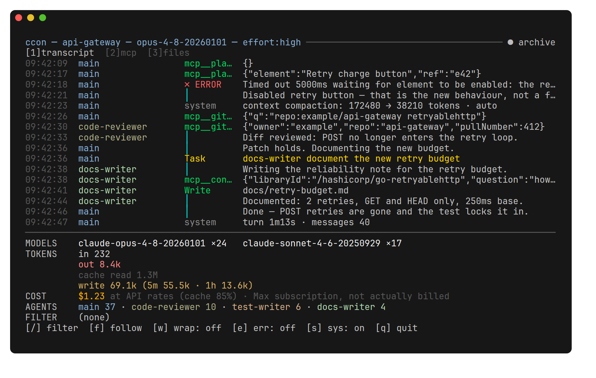
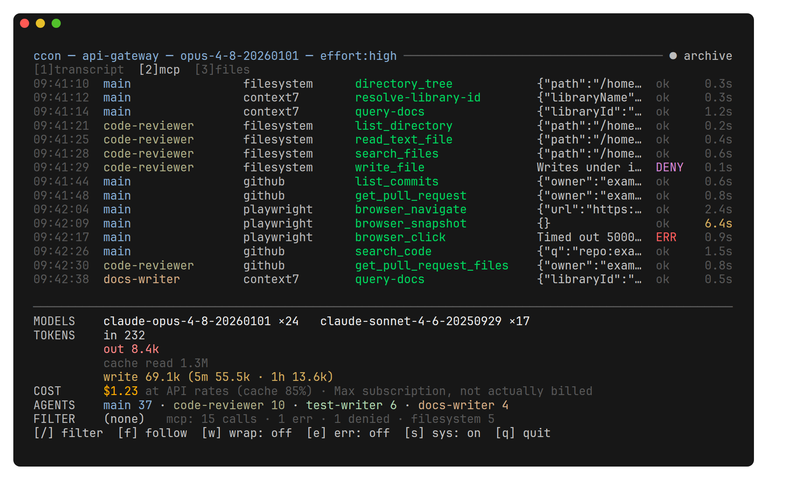
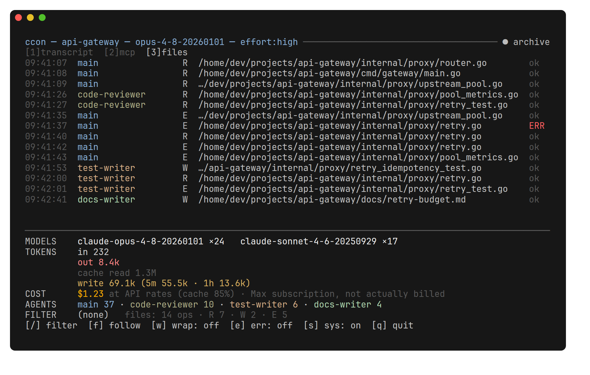
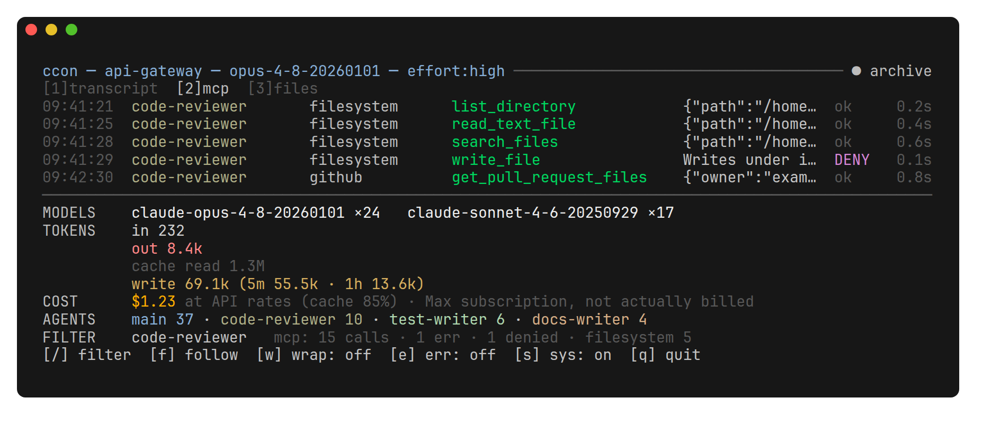

# ccon

[](LICENSE)

A terminal observer for Claude Code sessions. It reads the JSONL transcripts that Claude Code
writes under `~/.claude/projects` and shows what the session is actually doing: the stream of
actions, the tokens and money it burns, and the work of its subagents. It handles both a session
that is being written right now and one that finished long ago.

The reason it exists: while the main thread waits on a subagent, it **writes nothing**. Watching
only the main transcript shows silence for the whole time the delegate works. `ccon` follows every
file of the session at once and picks up new subagent streams as they appear.



Read-only: no network calls, nothing is ever written into `~/.claude`.

Every frame below is a real render of `examples/demo-session.jsonl`, a synthetic session shipped
with the repository — try it with `ccon examples/demo-session.jsonl`, no session of your own
required.

## Three tabs

New in 2.0.0. One event stream, three ways of looking at it. Switch with `1`, `2`, `3` or `Tab`;
`--view transcript|mcp|files` picks the tab the interface opens on — one tab per tmux pane.

**`[1] transcript`** — everything, in order: assistant replies, tool calls, delegations to
subagents, system records and tool errors. This is the frame above.

**`[2] mcp`** — MCP calls only, in columns: who called (main or a named subagent), which server,
which method, the arguments, the outcome and how long it took. A call slower than five seconds is
highlighted, so a stalling handle is visible without reading the numbers.



**`[3] files`** — file operations only: who, which operation (`R` read, `W` write, `E` edit,
`N` notebook edit), the full path and the outcome. The path is clipped from the head at a
component boundary, because the tail is what identifies the file. There is no duration column
here on purpose: reads and edits sit around 90 ms, so it would be noise.



Each tab keeps its own filter, its own toggles and its own reading position: switching back and
forth loses neither. Typing `/code-reviewer` on the `mcp` tab leaves only what that subagent
called — while the footer keeps counting the whole buffer, not the visible slice:

 Every call line is completed with its outcome in place as soon as the result
arrives — no second line appears.

## Call outcomes

There are four, and the difference between the middle two matters:

| Shown | Meaning |
|---|---|
| `ok` | the tool returned a result |
| `ERR` | the tool itself failed |
| `DENY` | a permission rule fired, or the user rejected the call |
| `·` | the call is still running — no result yet |

A denial is not an error and is counted separately: the `mcp` summary in the footer says
`N calls · N err · N denied`, and merging the last two would misreport failures. The `e` toggle
shows both, because both are questions that stayed open.

## Install

```bash
go install github.com/KratosUAE/ccon/cmd/ccon@latest
```

Prebuilt binaries for linux/amd64, windows/amd64 and darwin/arm64 are attached to
[GitHub Releases](https://github.com/KratosUAE/ccon/releases).

From source:

```bash
git clone https://github.com/KratosUAE/ccon
cd ccon
make build      # build ./ccon
make install    # and put it on PATH (BINDIR=~/.local/bin by default)
make help       # every target with a one-line description
```

Go 1.25+. Three external dependencies — `bubbletea`, `bubbles`, `lipgloss` — everything else is
the standard library.

A numbered build is `make release VERSION=v2.0.0`:

```
$ ccon --version
ccon v2.0.0 · go1.25.5 · linux/amd64
```

A plain `make build` passes no version on purpose. The binary then says `dev` and adds the
revision, commit time and dirty flag the toolchain compiled in — `ccon dev (a1b2c3d,
2026-08-06T05:35:25Z, dirty tree) · go1.25.5 · linux/amd64` — instead of claiming a number nobody
tagged.

## Usage

```bash
ccon                                  # TUI on the current session (needs a terminal)
ccon --view mcp                       # same, opened on the MCP tab
ccon --list                           # pick a session from a list of all projects
ccon --project ~/Devs/myproject       # a different project's session
ccon --dump path/to/transcript.jsonl  # print to stdout, no TUI
ccon --dump --follow                  # live stream to stdout, Ctrl+C prints the summary
ccon --dump --session <id>            # a specific session with its subagents merged
```

`--dump` writes plain lines to stdout — grep, tee and pipe them — and ends with the spend summary.
Diagnostics such as which file was opened go to stderr, so the stream stays clean:

```
11:53:40  main                Agent      test-writer cover the accumulator
11:53:42  test-writer         Read       cost/accumulate.go
11:53:58  test-writer         │          tests green, coverage 91%
11:54:02  main                mcp__con…  {"query":"viewport SetContentLines"}
11:54:10  main                ✗ ERROR    upstream timeout after 8s
11:54:11  main                system     turn 31.0s · messages 6
──────────────────────────────────────────────────────────────────────
MODELS    claude-opus-5 ×1
TOKENS    in 312 · out 1840 · cache read 410000 · cache write 22000
          write: 5m 22000 · 1h 0
COST      $0.39 at API rates (cache 88%) · Max subscription, not actually billed
TOTAL     events 6 · requests 1 · lines 7 · skipped 0
```

The session is found by the current directory. Started from a subdirectory of the project, `ccon`
prints the ready-made command with `--project`.

```
ccon [--version] [--list] [--dump] [--follow] [--view transcript|mcp|files] [--project <dir>] [--session <id>] [path to .jsonl]
```

| Flag | What it does |
|---|---|
| `--version` | print the version and exit |
| `--list` | pick a session from a list; without a terminal, print the list |
| `--dump` | print events to stdout instead of the TUI |
| `--follow` | follow the file as it grows (only with `--dump`) |
| `--project <dir>` | project directory instead of the current one |
| `--session <id>` | a specific session instead of the newest one |
| `--view <tab>` | start on `transcript`, `mcp` or `files` |

`--view` is a TUI flag; asking for it together with `--dump` is a usage error rather than a
silently ignored request. A positional path and `--project`/`--session` are mutually exclusive.

## Picking a session

With no arguments `ccon` takes the **newest transcript by write time** of the current project and
follows it. The choice is made once: if another session becomes the active one while `ccon` runs,
it will not notice — restart it. A transcript named explicitly, by `--session` or by path, is read
once as a finished one.

`--list` shows every session of every project, grouped by project and ordered by recency. `↑` `↓`
(or `k` `j`, `PgUp`, `PgDn`, `Home`, `End`) move the cursor, `Enter` opens, `Esc` quits. `●` marks
the newest session of a project — exactly the one `ccon` would take without `--session`. Without a
terminal the same list is printed as text, with full session ids to paste into `--session`.

The description comes from the transcript itself: the title from `ai-title` records (the same ones
`claude --resume` shows), the second line from `last-prompt`, the latest user message. Both are
shown because they answer different questions: the title is taken at the start of a session and
goes stale, the prompt says what the session is busy with now. A title may be missing — then a dash
stands there; putting a scrap of text in its place would be a lie.

Those two lines do not cost a full read of the file: only the tail is read, in a window from 128 KB
growing to 4 MB. Nothing found — a dash, but the list opens immediately.

A positional path to a `.jsonl` shows **exactly that file**. If subagent streams sit next to it,
`ccon` says so and suggests `--session` to merge them.

## Keys

| Key | Action |
|---|---|
| `1` `2` `3` / `Tab` | switch tab: transcript, mcp, files |
| `↑` `↓` `k` `j` `PgUp` `PgDn` `Home` `End` | scroll |
| `f` / `G` | jump back to the tail, re-enable auto-scroll |
| `/` | filter; `Enter` keeps it, `Esc` clears it |
| `Esc` | clear the filter |
| `e` | show only the unsuccessful: errors and denials |
| `s` | hide the system records (`turn_duration` and friends) |
| `w` | wrap long lines instead of cutting them |
| `q` / `Ctrl+C` | quit |

Scrolling up disables auto-scroll — the header then shows `● paused`; scrolling back to the bottom
turns it on again, as does `f`.

The filter is a case-insensitive substring, matched at once against the source, the tool name (or
the label of the event kind, such as `system`), the file path, the detail and the error text of a
failed call. The outcome itself is not part of it: that is what `e` is for.

Filters and toggles change only what is shown. The cost and token counters keep counting every
event regardless, while the per-tab summary in the footer is counted over the buffer (see
Limitations) and shrinks once the head of a very long session is trimmed.

## How the cost is computed

This is an estimate of "what it would have cost through the API". On a Max subscription nothing is
actually billed.

Three things without which the numbers would be wrong:

**Deduplication.** One logical reply is written as several JSONL lines sharing a `message.id` and
carrying the same intermediate `usage`. Summing them naively inflates the cost twofold and more.
The dedup key is the `(requestId, message.id)` pair; the winner of a group is the record with the
largest token sum. The rule "take the record with a non-empty `stop_reason`" does not resolve a
group: in real data it is non-empty on every line of the group.

**Cache multipliers.** Read `0.1×`, 5-minute write `1.25×`, 1-hour write `2.0×` — all against the
input price. Reads and writes differ twofold, so they are taken from the nested `cache_creation`,
with the flat field only as a fallback.

**Date-based rates.** A model may have several prices with validity intervals; the rate is chosen
by the time of the **event**, not by "now".

The cache share on the `COST` line is shown deliberately: it is usually 80–90% of the total. A
cache read is the cheapest token there is, at enormous volume, and methods that count it as free
give a figure three times smaller. Without that share the discrepancy looks like an error, though
it is not one.

## Event order

Live mode emits events **as they arrive**: a waiting window for the sake of sorting would kill the
point of "I see it now". Archive parsing **sorts by record time**: otherwise a subagent's stream
would arrive as one block after the main one.

The start of live mode is handled separately. Tailers read files from the beginning, and a short
fresh subagent file is finished before a long main one — without sorting, timestamps would jump
backwards by the whole age of the session. So the catch-up phase is finite, sorted by time, and
delivered as a single batch; ordinary following starts after it.

## Limitations

- A ring buffer of 10,000 events: a long session does not eat memory. The cost and token counters
  are accumulated separately and are not affected by trimming, but the per-tab summary
  (calls/errors/denials in the footer) is counted over the buffer and drops once the head of a very
  long session gets evicted.
- Tailing by polling every 200 ms, no `fsnotify`: simpler, more reliable across filesystems, and it
  does not run into the inotify watch limit with fifty subagents.
- The parser is forgiving: an unknown record type is skipped, a missing field does not crash
  anything, a broken JSON line is skipped. The number of unparsed lines is visible in the footer.
- A line longer than 64 MB is dropped on its own and counted as skipped — one anomalous line must
  not cost you the whole file.
- The transcript format is Claude Code's private business and can change without notice. Unknown
  records are skipped rather than guessed at.

## Platforms

**Linux** is the primary platform: developed and used there.

**macOS** builds (`darwin/arm64`) and there is nothing platform-specific in the way; it has not
been exercised on a live session.

**Windows** builds (`windows/amd64`). Session directories are found correctly — the rule that turns
a project path into a store directory name was checked against a real Windows transcript store —
and file paths, including drive letters and UNC, are shown and clipped correctly. The tailer has
not been exercised on a live, growing session under Windows.

## Development

```bash
make check      # gofmt + go vet + staticcheck + the suite under -race
make cover      # per-package coverage; every package is above 80%
```

```
cmd/ccon/          flags, modes, the bridge between the watcher and the interface
internal/parse/    JSONL → events, log line formatting
internal/cost/     rate table with date intervals, accumulator with deduplication
internal/session/  session discovery and listing, file watching, agent names
internal/tailer/   reading a growing file
internal/ui/       model, tabs, layout, theme, ring buffer, session picker
```

Comments in the source are in Russian — they explain *why* a decision was made, not what the line
does. The program itself and its documentation are in English.

## License

MIT — see [LICENSE](LICENSE).
